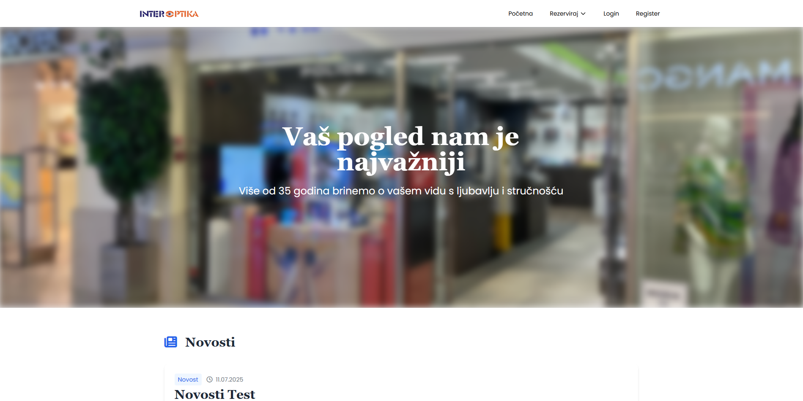
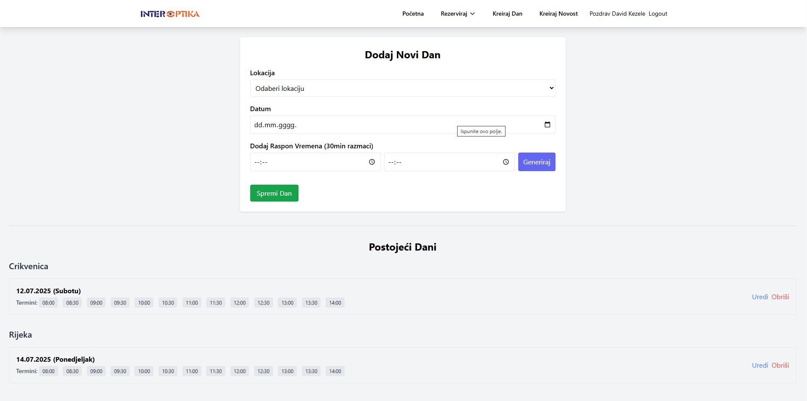
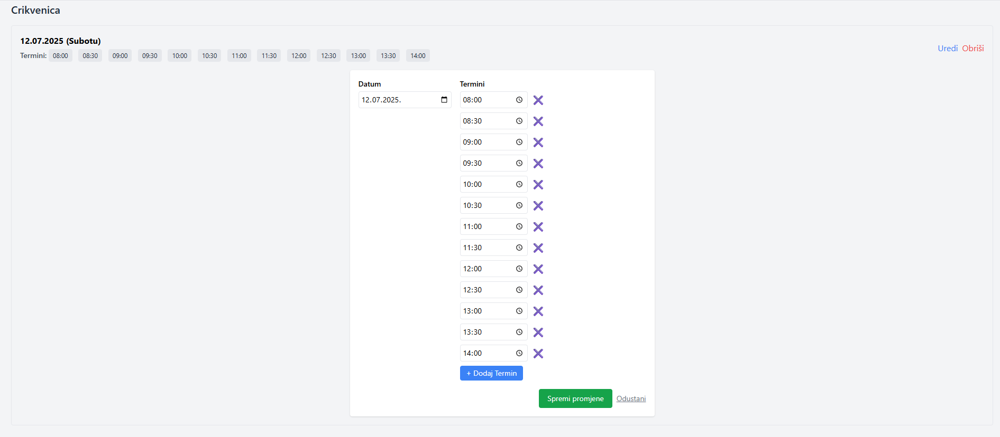
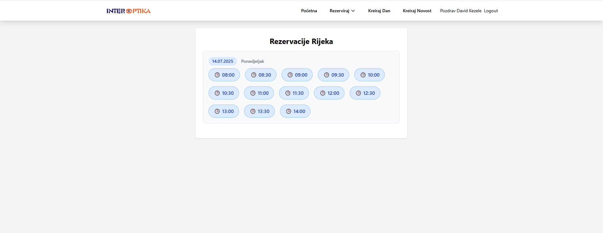
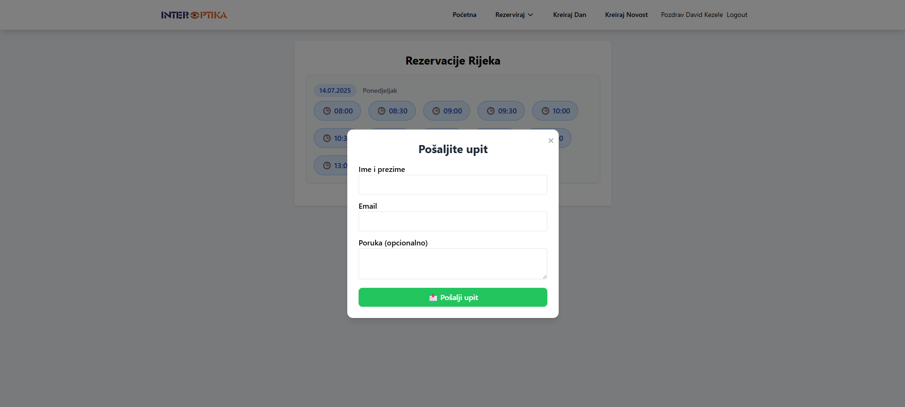
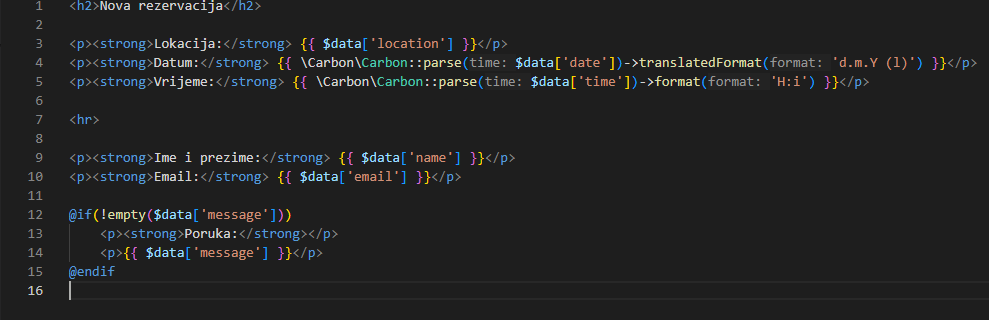
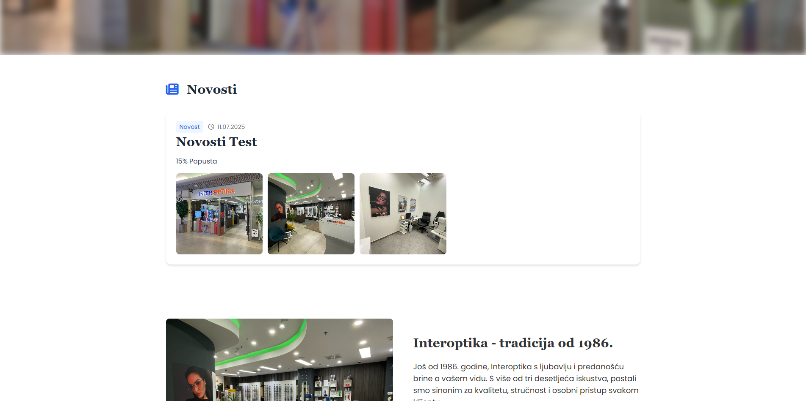
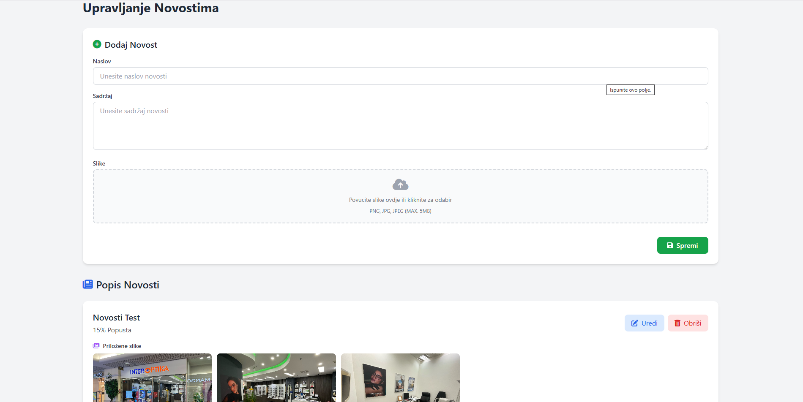

# Laravel Reservation, Day Management and Landing Page System For A Optical Store Buissness

This system is made to help my cliend handle appointment bookings.

---

## 🛠 Features

- Admin panel for:
  - Creating, editing, deleting days
  - Creating, editing, deleting news(sale discounts, new products etc.)
  - Adding, updating, removing time slots
  - Separate handling for two shops
- Customer-facing view for selecting available dates and times
- Real-time feedback using AJAX and notifications
- Custom Blade views and responsive Tailwind layout
- Scroll-based animations for a smooth user experience

## 💻 Tech Used

### 🔙 Backend
- PHP 8+
- Laravel Framework
- MySQL Database
- Laravel Eloquent ORM

### 🎨 Frontend
- Blade Templating Engine
- Tailwind CSS
- Vanilla JavaScript
- Font Awesome (icons)

### 🛠 Tools & Features
- Composer (PHP dependency manager)
- AJAX for dynamic UI
- Responsive layout
- Scroll-based animations

---

## 📸 Landing Page

### 🧑‍💼 Admin Panel - Day Management

Admin is able to enter a date, pick a optical shop store location(Rijeka or Crikvenica) and add timeslots in a range from - to.

Meaning if he enters FROM (8:00) TO (16:00) the system will generate all the timeslots in the given timeframe split by 30 minutes each(what is exacly what client asked for) which makes it
user firendly.

---

### 🕒 Add/Edit Time Slots

If Admin confirms booking to a client he has to manually remove the booked timeslot client asked for(it had to be done this way since no online payments and to prevent false booking spams).

---

### 👤 Customer Reservation View

Client is able to pick one of two given locations.

When location is picked he is redirected to a view file that contains all dates with timeslots for a desired store.

---

### 👤 Customer Book View

The idea is for user click on the any given avalible timeslot to proceed with the booking process, which sends an booking request to Admin via SMPT.

---

### 👤 Booking Received

Admin gets an email in the following format

---

### 🧑‍💼 Admin Panel - News Management

News are displayed on a landing page (no pagination inclueded because client states that there will be no more than 3 at the time).

---

### 👤 Add News

Admin is able to add news, enter title, main content and images optionally.

---

